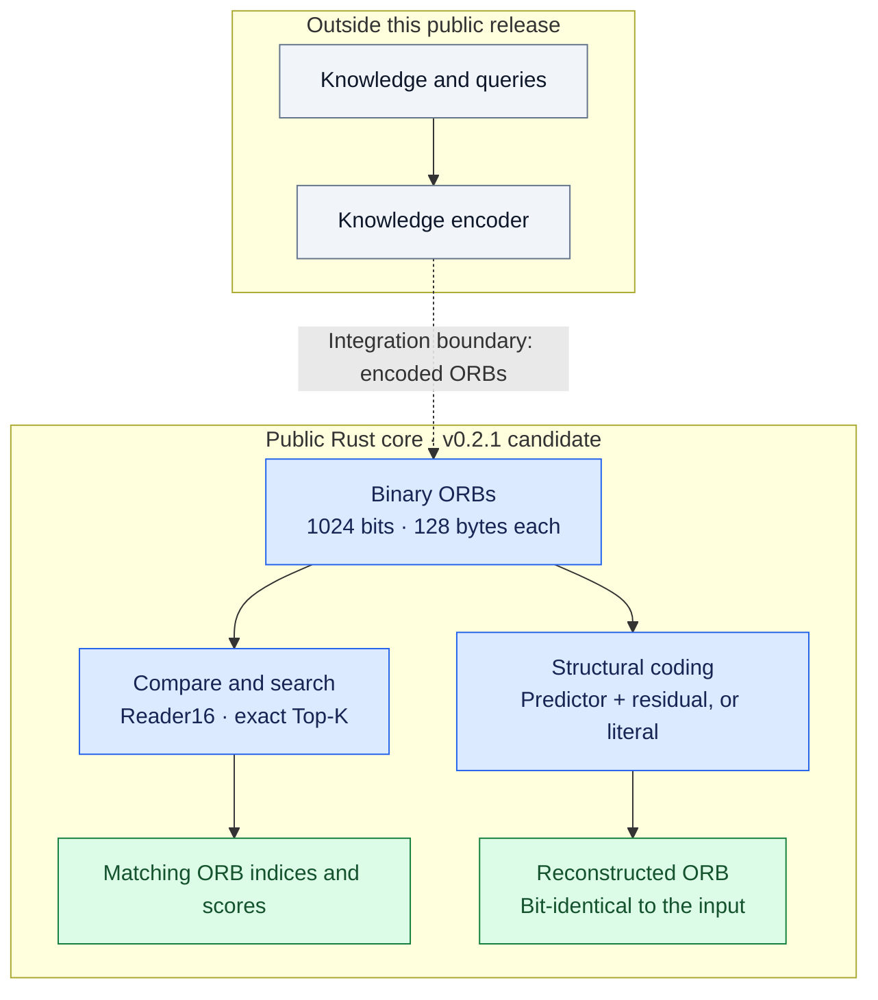

# GEL RAM

**A Rust memory core for an AI knowledge bank — bit-exact binary reconstruction and reproducible hardware benchmarks.**

The goal of GEL is a knowledge bank for AI: preserving encoded knowledge and making it available for associative readout. Persistence supports that goal; it is not the purpose of the project by itself.

This repository publishes a focused part of that work. GEL RAM v0.2.1 candidate locates, compares, persists and structurally reconstructs fixed binary records called **ORBs**, with predictable RAM cost and measurable latency. It is not yet a complete text-to-knowledge system: the public core does not include a knowledge encoder or an end-to-end question-answering demo.

## v0.2.1 candidate: exact readout, less repeated work

- Full Top-K rejects candidates that cannot enter the result set before scanning the sorted results. Progressive Top-K reuses the already counted prefix. Scores, strict pruning and index-based tie ordering are unchanged.
- A same-binary [comparison instrument](docs/TOPK-BENCHMARK.md) retains the v0.2.0 algorithm as a control. No extra search index or private knowledge encoder is needed.
- Default loading is bounded to 256 MiB of ORB payload; larger trusted inputs require explicit limits.
- Generation-guarded writes verify the existing payload before replacement. Legacy v1's unprotected generation cannot authorize a monotonic write.
- The [data-integrity audit](docs/DATA-INTEGRITY.md) independently checks exact reconstruction and ranking, and separates FP16/Q8 conversion loss from GEL transport errors.

This is a **local candidate, not a published release**. Passing binary tests does not establish 99% knowledge retrieval. The experimental verified-range interface is not included.

Local Ryzen AI 9 HX 370 measurements, three trials, unchanged exact results:

| Full Top-32 workload | Profile | Old/new latency ratio |
|---|---|---:|
| 16 MiB uniform synthetic ORBs | Portable | 2.67–3.24× |
| 16 MiB uniform synthetic ORBs | x86-64-v3 | 3.67–5.63× |
| 509 text-derived ORBs, heldout text queries | x86-64-v3 | 1.78–2.35× |

These are workload-specific CPU latency results, **not** semantic accuracy or
a universal speedup. K=1 includes regressions. The [full validation record](docs/VALIDATION-v0.2.1.md)
contains every planned case, raw samples, hardware settings, FP16/Q8 fidelity
results, and the still-unmet natural-text retrieval gate.

## GEL at a glance



The public-core box shows available operations; the dashed arrow marks an external integration, not a bundled end-to-end demo. Exact reconstruction refers to the **input ORB bytes**, not automatic recovery of the original knowledge or a generated answer. Persistence and hardware probes are omitted here for clarity.

## What you can verify today

- **Exact reconstruction:** recover the original ORB from a predictor and its residual, bit for bit; retain a literal when structural coding would cost more.
- **Exact search over encoded ORBs:** compare full and progressive Top-K, and single-thread and multi-thread Top-1, with deterministic tie handling.
- **Measurements on your own hardware:** run the self-test and cache/RAM probes, and inspect benchmark correctness alongside latency and memory traffic.

Start with the [Quick start](#quick-start). The [measurement methodology](docs/PERFORMANCE.md) and [recorded hardware experiments](docs/SILICON-2026-09-04.md) explain how to reproduce and interpret the results.

**Bit-exact reconstruction is not the same as correct knowledge retrieval.** The current synthetic benchmarks test the binary engine; they do not establish 99% semantic accuracy or a quality advantage over FP16/Q8. Those require separate, matched tests on real encoded knowledge.

## Canonical ORB

- 1 ORB = **1024 bits = 128 bytes**.
- In RAM: 16 contiguous `u64`, aligned to 64 bytes.
- Exact byte round-trip is mandatory.
- No lossy conversion is performed by the public core.
- No Python, JavaScript, TypeScript, shell implementation or foreign runtime is part of the project.

## v0.2.0 additions

### F0 — memory physics

`gel-physics` measures the machine instead of assuming it:

- dependent pointer-chase latency across cache/RAM-sized working sets,
- sequential read bandwidth: a vectorizable reduction with no per-element barrier over 64-byte-aligned buffers (probe header `GEL_PHYSICS_F0_V3`),
- random 32/64/128-byte ORB fetch cost: throughput over independent fetches, not dependent latency,
- Linux THP state and observed L3 cache domains,
- nanoseconds and GiB/s as authoritative measurements; no cycle estimates from sysfs frequency.

### F1 — Reader16

`gel-reader` separates two concepts:

1. reversible coordinate geometries (`reverse`, `rotate`, masks, affine permutations), and
2. information-bearing reader judgments.

`reader16()` performs one fused comparison and returns:

- global XNOR,
- Jaccard,
- Dice,
- A→B inclusion,
- B→A inclusion,
- signed phi correlation,
- contradiction,
- asymmetry,
- eight disjoint local 128-bit agreement views.

The project **does not claim these 16 numbers are 16 independent Shannon channels**. Geometry is never counted as new information. Incremental task information must be measured on real data.

### F2 — structural exact codec

`gel-structural` implements bit-exact prediction:

```text
predictor XOR residual = exact ORB
```

- no floating-point prediction,
- 10-bit sparse residual positions,
- automatic sparse/dense residual choice,
- literal fallback when delta coding is not smaller,
- prototype or segment-local parent references,
- hard delta depth ≤ 2,
- deterministic best-prototype selection,
- exact decode or failure.

The residual-only sparse/dense boundary is exactly 100 flipped bits in this format. Once parent metadata is counted, the actual whole-record break-even is 94 flips for a prototype parent and 96 for a segment-local parent. The code tests these boundaries explicitly.

## Workspace

- `gel-core` — constants, errors, CRC64-ECMA and deterministic primitives.
- `gel-orb` — canonical 1024-bit ORB.
- `gel-kernel` — fixed 1024-bit POPCOUNT kernels, contingency and progressive bounds. The kernels are plain `u64::count_ones()`; the emitted instructions depend on the build target features. No hand-written SIMD.
- `gel-reader` — reversible geometry, Reader16, deterministic Top-K, exact progressive pruning, exact multi-thread Top-1 (`top1_threads`).
- `gel-structural` — exact prototype/residual structural codec; sparse residuals with nonzero padding bits are rejected.
- `gel-store` — `.gel` persistence, header+payload CRC64, generation rollback rejection, bounded open, streaming `verify_file`, and explicit on-disk v1/v2 reporting.
- `gel-physics` — F0 cache/RAM measurement harness.
- `gel-bench` — reproducible full-scan benchmark.
- `gel-cli` — integrated self-test and streaming store verification.
- `xtask` — Rust-only gates, tests, benchmark and physics orchestration.

## Quick start

```text
cargo run --locked --offline -p xtask -- verify
cargo run --locked --offline -p xtask -- physics 5
cargo run --locked --offline -p xtask -- bench 1310720 16
cargo run --locked --offline -p xtask -- bench 1310720 16 1
cargo run --locked --offline -p xtask -- bench 1310720 16 4
```

`rust-toolchain.toml` pins Rust 1.85.0; rustup installs that toolchain automatically on the first `cargo run`.

Normal builds use rustc's portable target defaults. Hardware-specific builds
must be requested explicitly and recorded with their results. For example,
`RUSTFLAGS="-C target-cpu=native" cargo run ...` enables features of the build
machine. On x86-64, `RUSTFLAGS="-C target-cpu=x86-64-v3" cargo run ...` is a
stable POPCNT/AVX2 measurement profile that excludes AVX-512 without relying
on an unstable `target-feature` switch. Results are bit-identical; only timing
changes. `docs/SILICON-2026-09-04.md` records the measured baseline, native,
x86-64-v3 and historical AVX-512-off profiles. The `backend=` line of
`gel-bench` records which features were compiled in.

`verify` runs the Rust-only, licensing, CI-policy and docs-refs gates (every
backtick-quoted repository path in Markdown files must exist), formatting,
Clippy with warnings denied, the release build, rustdoc with warnings denied,
the workspace tests, the `gel-cli` selftest and a `gel-bench` smoke run (8192
ORBs, 3 rounds, 2 threads then 1 thread). The Rust-only gate also rejects
symlinks and executable files in the release tree.

`bench` takes `<ORB_COUNT> <ROUNDS> [THREADS]`. `THREADS` defaults to 1; for `THREADS` > 1 it must satisfy `2 * THREADS <= ORB_COUNT`, and it must always satisfy `THREADS <= 4 x available parallelism`; other values are rejected. The multi-thread scan is an exact merge (lowest index wins a tie) and must return the same Top-1 as the single-thread scan: `thread_scan=` names the path taken (`single` or `exact_merge_lowest_index_tie`) and `thread_scan_exact=` prints `PASS` when the multi-thread Top-1 equalled the single-thread Top-1 in that run, or `SINGLE` for `THREADS` = 1. The output header is `GEL_BENCH_V3`. The `backend=` line prints `count_ones(popcnt=..,avx2=..)`: whether the `popcnt` and `avx2` target features were enabled when the binary was compiled, which decides the instruction rustc emits for `u64::count_ones()`. AVX-512 use cannot be observed through `cfg` on Rust 1.85 and is checked by disassembly in the measurement record. `observed_cpu_start=` and `observed_cpu_end=` are a best-effort Linux reading of the CPU the process ran on; they document a run and do not replace pinning.

For larger RAM sweeps, increase the ORB count. One ORB is always 128 bytes before structural coding.

Reproducibility: on CPUs with several L3 domains, pin the process to one domain and report which domain (and its L3 size) it was, for example:

```text
taskset -c 0-3 cargo run --locked --offline -p xtask -- bench 1310720 16 1
```

Unpinned results for working sets that fit one L3 domain but not another are not reproducible; see `docs/PERFORMANCE.md`.

## Correctness policy

A performance change is accepted only if all relevant results remain exact:

```text
scalar/reference result == optimized result
full Top-K == progressive Top-K
original ORB bytes == structural decode bytes
written store == reopened store
```

v2 persistence protects both metadata and payload with CRC64-ECMA. Single-writer generation rollback is rejected.
On Unix, a newly created store is mode `0600`, while an atomic replacement
preserves the existing file mode. Legacy v1 input is reported as v1 even
though a subsequent write deliberately migrates it to protected v2.

## Scope

This repository is the public GEL binary memory engine. It intentionally contains no LLM, agent framework, model weights, tokenizer, multimedia pipeline or private source-data encoder.

Structural coding in v0.2.0 reconstructs **ORB1024 itself**. It does not claim that arbitrary 2 KiB F16 data can always be recovered from 128 bytes. Larger exact reconstruction requires shared context whose storage and access cost must be included in the measurement.

The structural representation is an in-memory v0.2 contract. The `.gel` v2
store remains a flat sequence of 128-byte ORBs; it does not yet persist
structural residual records.

See `docs/ARCHITECTURE.md`, `docs/FORMAT.md`, `docs/READER16.md`, `docs/STRUCTURAL-CODEC.md`, and `docs/PERFORMANCE.md`.

## About the project

GEL RAM is an independent hobby project. I am a hobbyist, not a professional programmer, and I use AI tools to help turn my ideas into code, investigate problems and develop tests. I guide the project's direction and decide which changes to accept.

AI assistance is part of the development process, not evidence that a result is correct. The standard for this project is reproducible tests, explicit limitations and measurements on identified hardware. Independent reproduction, bug reports and constructive technical criticism are welcome.

## Licensing

- Noncommercial use is permitted under PolyForm Noncommercial License 1.0.0 (`LICENSE`, `LICENSING.md`).
- Commercial use requires a separate signed agreement; contact gelram.licensing@gmail.com (`COMMERCIAL-LICENSE.md`).
- Contributions require a privately completed CLA before a pull request is opened (`CLA.md`, `CONTRIBUTING.md`).
- The name GEL RAM is not licensed.
